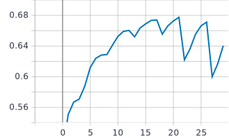
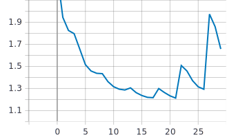
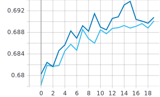
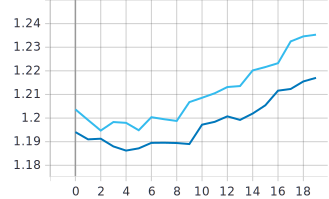

Лабораторная работа №5
====
# Цель лабораторной работы
Обучить нейронную сеть с использованием техники обучения Fine Tuning

# 1. С использованием примера [2], техники обучения Transfer Learning [1], оптимальной политики изменения темпа обучения, аугментации данных с оптимальными настройками обучить нейронную сеть EfficientNet-B0 (предварительно обученную на базе изображений imagenet) для решения задачи классификации изображений Food-101:

## Применённые политики изменения темпа обучения и аугментации данных
 
 ```
tf.keras.experimental.CosineDecayRestarts(0.0001, 10000, 1.0, 2.0)
tf.keras.layers.experimental.preprocessing.RandomFlip('horizontal')
```

### Графики обучения для сети EfficientNet-B0

* Синий график - на валидационных данных
* Оранжевый график - на обучении

**График метрики точности:** 


**График функции потерь:**


### Вывод:
Наилучшее значение точности на валидационных данных достигается на 21 эпохе и значении 67,78%.


# 2. С использованием техники обучения Fine Tuning дополнительно обучить нейронную сеть EfficientNet-B0 предварительно обученную в пункте 1:

### Графики обучения для сети EfficientNet-B0

* Синий график - запуск Fine Tuning после 21 эпох обучения (на следующей же эпохе, после достижения максимальной точности)

* Голубой график - запуск Fine Tuning после 21 эпох обучения (до момента достижения максимальной точности)

**Графики метрики точности:** 


**Графики функции потерь:**


### Вывод:
Максимальная точность достигаетс синим графиком на 15 эпохе при значении 69,38%, что соответствует запуску Fine Tuning сразу же после достижения максимальной точности основной модели (модели из пункта 1) .
	
# Анализ результатов

В результате первого эксперимента максимальная точность достигается на 21 эпохе и значении 67,78%. 
В результате 2 эксперимента, наилучшее значение оказалось в случае запуска Fine Tuning сразу же после 21 эпохи. В таком случае максимальная точность достигается через 15 эпох и значении 69,38. Случай запуска Fine Tuning после 15 эпох так же улучшил максимальное значение точности, но уже на 19 эпохе и значении 69,01.
